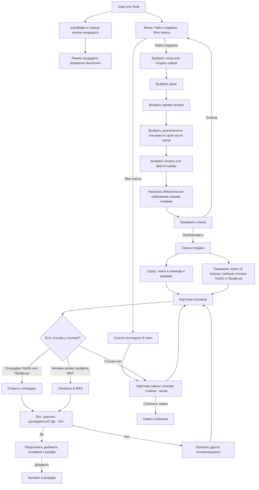
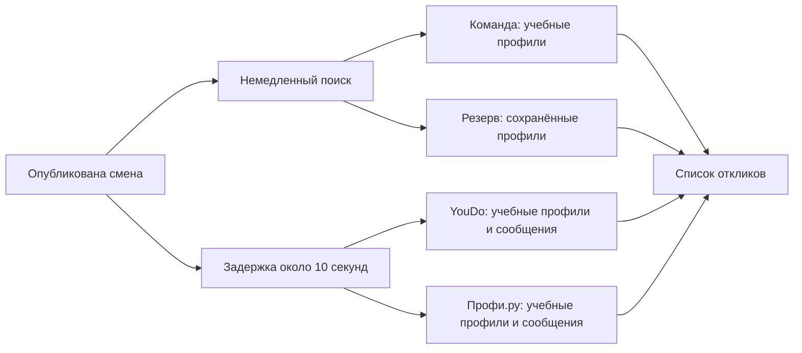
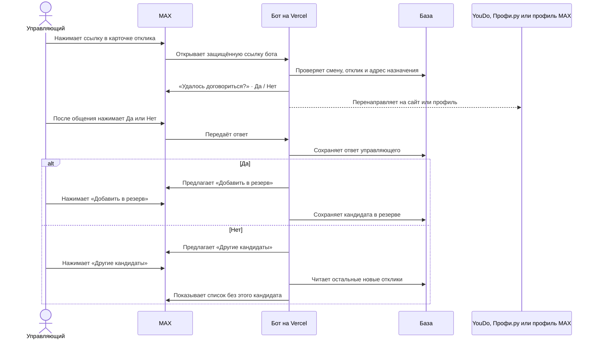
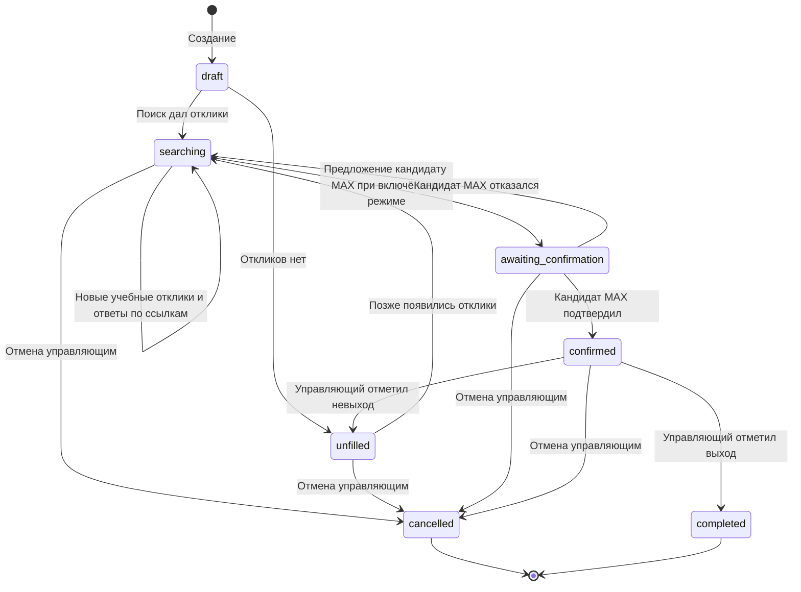

# Карта логики бота «Подмена»

**Состояние на 30 сентября 2026 года.** Это карта текущей реализации чат-бота MAX. В ней отдельно отмечены реальные действия бота, учебные данные и выключенный сценарий кандидата. Мини-приложение в эту карту не входит.

## 1. Весь путь управляющего

**Важно:** нажатие ссылки открывает сайт или профиль и одновременно отправляет вопрос в чат. Бот не знает, состоялся ли разговор. Ответ «Да» или «Нет» вводит сам управляющий после общения.

## 2. Шаги создания смены

| Шаг | Что видит управляющий | Что принимает бот | Если ввод неверный |
| --- | --- | --- | --- |
| Точка | До 6 сохранённых точек и «Новая точка» | Кнопка существующей точки; для новой — название 2–80 символов и адрес 5–150 символов | Просит выбрать точку или исправить название/адрес |
| День | «Сегодня», «Завтра», «Послезавтра», «Другая дата» | Кнопка или дата и время `ДД.ММ.ГГГГ Ч:ММ` | Просит будущую дату минимум через час |
| Время | `09:00`, `12:00`, `18:00`, «Другое время» | Кнопка или введённое время; часовой пояс — Москва | Просит другое время или день |
| Длительность | 4, 6, 8, 12 часов и «Своё количество часов» | Целое число от 1 до 24 | Просит число от 1 до 24 |
| Оплата | 4 000, 5 000, 6 000 ₽ и «Другая сумма» | Целая сумма 1 000–100 000 ₽ за смену | Просит исправить сумму |
| Требование | Просьба написать обязательное требование | Свободный текст 2–120 символов; показывается в карточке смены | Просит написать требование словами |
| Проверка | Точка, время, часы, оплата, требование | «Опубликовать смену» или «Отмена» | Публикации без подтверждения нет |

Роль в текущем боте всегда **бариста**. Конец смены вычисляется из времени начала и выбранных часов. Данные незавершённого диалога сохраняются в базе; «Меню» и «Отмена» прерывают ввод. С экрана проверки нельзя вернуться к отдельному полю: для исправления нужно начать создание заново.

## 3. Поиск и происхождение откликов

| Источник | Что происходит сейчас | Ссылка в карточке |
| --- | --- | --- |
| Команда | Поиск в тестовых профилях конкретного управляющего; учитываются доступность, совпадение требования, бюджет и пересечение с активными предложениями | Нет |
| Резерв | Поиск среди сохранённых в резерве профилей; учитываются те же ограничения | Нет, если отдельно не сохранена ссылка MAX |
| YouDo | Через заданную задержку бот моделирует отклик и текст сообщения; реальная заявка не публикуется | На главную страницу YouDo |
| Профи.ру | Через заданную задержку бот моделирует отклик и текст сообщения; реальная заявка не публикуется | На главную страницу Профи.ру |
| Кандидаты MAX | Новые смены их не ищут; роль кандидата и отправка предложений сейчас выключены | Старые отклики MAX скрыты из списка |

Для учебных внешних откликов бот может показать ставку **выше бюджета** и требование, которое ещё нужно уточнить. В первом уведомлении он показывает по одному отклику с каждой площадки; кнопка «Все отклики» открывает список, где одновременно видны до пяти новых карточек.

## 4. Ссылка, ответ управляющего и резерв

- Кнопка площадки есть только у откликов YouDo и Профи.ру. Она открывает **главную страницу**, поскольку конкретной реальной заявки на площадке нет.
- Кнопка «Написать в MAX» появляется лишь при сохранённой корректной ссылке на профиль человека. У учебных профилей такая ссылка по умолчанию отсутствует.
- Ссылка проходит через адрес бота: она подписана, действует 7 дней и сверяется с сохранённым откликом. Бот отправляет вопрос **один раз для пары «смена + человек»**; повторное открытие той же ссылки не создаёт новые вопросы.
- Если отправить вопрос временно не удалось, переход на сайт всё равно происходит. Повторное открытие ссылки даёт возможность повторить отправку вопроса.
- «Да» означает **сообщение управляющего о договорённости**. Это не подтверждение самого кандидата и не переводит смену в статус «Выход подтверждён».
- Добавление в резерв доступно после «Да». «Нет» предлагает список без выбранного человека; в общем списке откликов он пока остаётся.

## 5. Состояния смены

В **текущем включённом сценарии** путь через предложение кандидату MAX недоступен. Поэтому ответы «Да/Нет» после внешней ссылки записываются отдельно и **не меняют статус смены**. Кнопки «Отметить выход» и «Невыход» появляются только у смены в статусе «Выход подтверждён»; получить этот статус через учебный внешний отклик в чате сейчас нельзя.

## 6. Меню, старые кнопки и служебная логика

| Действие | Текущее поведение |
| --- | --- |
| `/start`, `/help` | Краткое объяснение и кнопки «Найти подмену», «Мои смены» |
| `/manager`, «Меню» | Возврат к меню управляющего |
| «Мои смены» | Последние 8 смен; из карточки можно открыть отклики или отменить активную смену |
| `/cancel`, «Отмена» | Очищает текущий шаг диалога и показывает меню |
| `/candidate`, «Я кандидат», старые кнопки `c:*` | Сообщение, что режим кандидата временно выключен; данные существующих профилей не удаляются |
| Старая кнопка поиска или предложения MAX | Сообщение, что поиск/предложение временно выключены |
| Повторное событие MAX | Бот распознаёт уже обработанное сообщение/нажатие и не создаёт дубликат действия |
| Групповой чат или сообщение самого бота | Игнорируется; сценарий рассчитан на личный чат |

MAX передаёт текст и нажатия кнопок на защищённый webhook. Секрет проверяется до обработки. Состояние диалога, смены, отклики, резерв и очередь исходящих сообщений хранятся в базе. После публикации отложенная задача отправляет учебные отклики примерно через 10 секунд; эта задержка не означает соединение с внешними площадками.

## 7. Границы текущего MVP

1. **Нет реальной публикации на YouDo и Профи.ру.** Их профили, сообщения и ответы созданы для демонстрации; ссылки ведут на главные страницы.
2. **Роль кандидата MAX выключена.** Отдельное согласие кандидата и полноценное подтверждение смены сейчас недоступны в новом чат-сценарии.
3. **Договорённость после перехода по ссылке вводит управляющий.** Бот не получает подтверждение сделки от площадки или человека.
4. **Добавление в резерв не закрывает смену.** Это отдельное действие; статус смены остаётся прежним.
5. **Нет ссылки на MAX у учебных кандидатов, пока она не сохранена явно.** Бот не строит ссылку по имени или числовому ID.
6. **Текст обязательного требования не попадает на внешние площадки.** Сейчас он хранится в смене и показывается управляющему, но реальной публикации для кандидатов нет.

Основной код этой карты: [`server/chat-bot.js`](../server/chat-bot.js), [`server/domain.js`](../server/domain.js), [`server/http.js`](../server/http.js), [`server/outbound-links.js`](../server/outbound-links.js).
